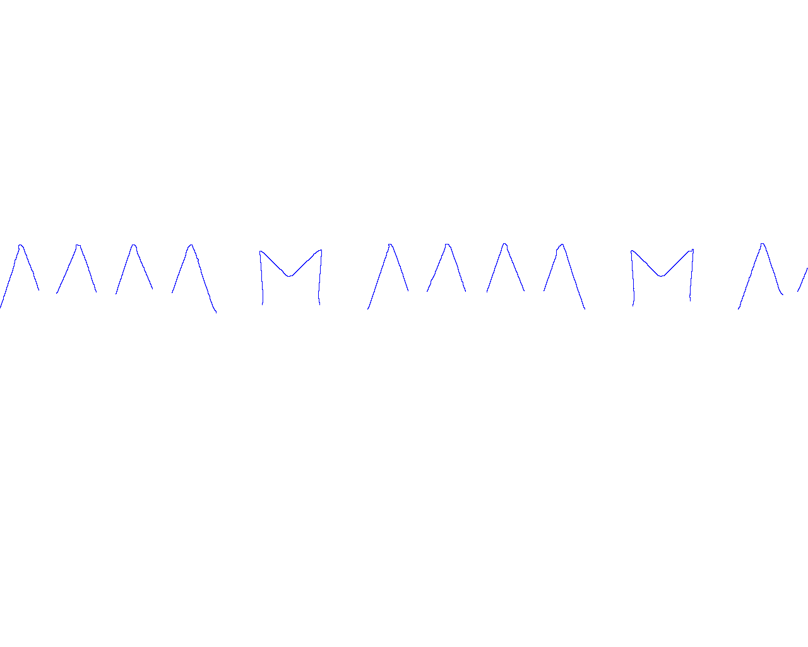

**Visual Inspection of Blade Tools**

Given a set of images concerning blade tools and taken by the backlighting technique (as shown in Figure 1 below), students should develop a software system aimed at inspecting the angles associated with the teeth of the blade.

In order to carry out measurement and inspection of the angles associated with the teeth of the blade, the following processing steps might be deployed:
1. Contour extraction (see Figure 2).
2. Extraction of the connected components associated with contours (with contours possibly represented as chains of points) with filtering of possibly noisy (i.e. small) components.
3. Segmentation of contours into line segments and circular arcs. To this purpose, the Ramer-Douglas-Peucker algorithm may be deployed (see e.g. references [1], [2]), with references [3],[4] providing interesting additional material concerning polygonal approximation of contours.
4. Detection of the geometric primitives relevant to the inspection task based on keeping the line segments within a certain size range and discarding circular arcs (see Figure 3).
5. Measurement of the angle associated with each teeth in order to assess whether such angle falls or not within a given allowance range, R, selectable by the user as a parameter of the system (e.g. R=[37°: 42.5°]). Examples of angles to be measured and verified are shown in Figure 4.
6. Results of the teeth inspection process must be properly overlaid onto the input grayscale images so to highlight which angles fall within the chosen allowance range and which ones turn out instead out-of-range (i.e. teeth are defective).

**Figure 2**: Extracted contours

**Figure 3**: A sample output of the contour segmentation step is depicted in Figure 3.

**Figura 4**: Examples of angles to be measured and verified.

Finally, as an optional requirement, students may also verify that the triangular shape of teeth is not significantly corrupted by burrs or other possible imperfections. Purposely, the two edges associated with the angle of a tooth should be as rectilinear as not to deviate by more than 5 pixels from the ideal straight profile.

**References**

[1] U. Ramer. “An iterative procedure for the polygonal approximation of plane curves.” *Computer Graphics and Image Processing*, 1:244-256, 1972  
[2] Steger,Ulrich,Wiedemann *“Machine Vision Algorithms and Applications”* , WILEY-VCH  
[3] P.L.Rosin. “Techniques for assessing polygonal approximations of curves”. *IEEE Transactions on Pattern Analysis and Machine Intelligence*, 19(6): 659-666, June 1997  
[4] P.L.Rosin. “Assessing the behaviour of polygonal approximations algorithms”. *Pattern Recognition*, 36(2): 508-518, 2003
